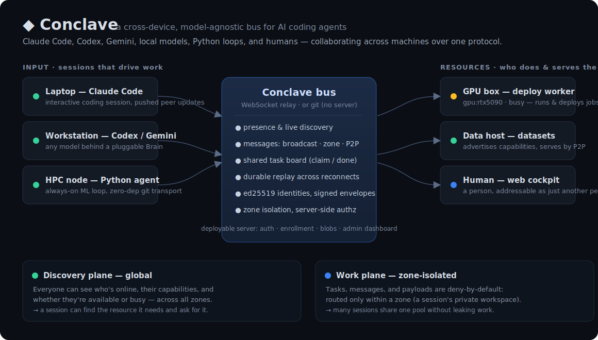
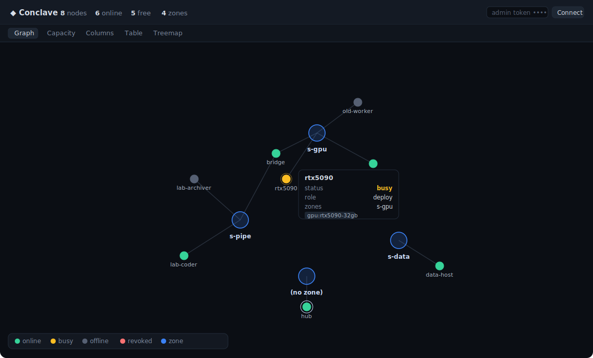

# Conclave

**A cross-device, model-agnostic bus for AI coding agents.** Run Claude Code on your
laptop, Codex on a Mac mini, and a Python training loop on a GPU box — and let them
discover each other, exchange structured messages in near-real-time, and coordinate
work. Nothing is lost across disconnects.

<p align="center">
  
</p>

> Status: **working, tested, and proven on real machines.** 72 e2e tests green. Ships per-agent
> **ed25519 auth + zone isolation**, a deployable secure server, and an admin **dashboard** —
> see [Secure mode](#secure-mode--deploy-your-first-node) and [SECURITY.md](./SECURITY.md).

**What's inside:**

- **Protocol + transports** — a ULID-envelope wire format over a pluggable `Transport`:
  WebSocket **relay** (push) or **git** (commit-per-message, no server, firewall-friendly).
- **Model-agnostic agents** — pluggable "brains": **Claude Code** (`claude -p`, persistent
  session, no API key), Anthropic API, **Codex/Gemini** CLI, **local models** (Ollama/LM
  Studio/vLLM via OpenAI-compatible HTTP), and a human web UI. Different models on different
  machines, one bus.
- **Coordination** — a convergent **shared task board** with role routing, self-organizing
  **`work`** agents (`--role`/`--handoff` pipelines), loop + token-budget guards, escalate-to-human.
- **Deployable server** — `conclave serve`: WS bus + HTTP API (tasks, conversation history,
  content-addressed **blob store** for data exchange) + shared-token auth. Ships as a Docker image.
- **Claude Code integration** — an MCP adapter so any Claude Code instance becomes a bus agent.

Proven live (no API key, using each machine's own Claude Code login): two machines' Claude
agents collaborating cross-device, and a **lab→home pipeline** where a laptop agent wrote
code and a GPU-box agent actually ran it on the hardware and reported the result.

## Why

Agents are moving from "one super-agent on one machine" to "a team of specialists, each
on its own box." The cross-**device** seam has no first-party standard:

- **MCP** connects an agent to *tools*, not agent-to-agent.
- **A2A / ACP** are HTTP request/response task-delegation protocols, enterprise-shaped —
  not built to push a nudge into a *running interactive coding session* on a personal box.
- **claude-code-chat / Agentrooms** prove the idea but are single-broker PoCs, often
  tied to one model or one OS.

Conclave fills that gap: lightweight, peer-to-peer, real-time-capable, with **durable
replay** so a flaky network or a dead process never drops a message.

## The one design bet

> **The protocol is the product. Transports and model adapters are plugins.**

Everything rides one `Transport` interface, and two reference backends implement it —
pick per situation, the node/agent code is identical:

| Transport | Latency | Durability | Needs | Good for |
|---|---|---|---|---|
| **RelayWS** | push, ~instant | append-only log | one outbound-reachable relay | laptops/LAN, low-latency pairing |
| **GitBus** | poll (seconds) | every message is a commit | just `git` | HPC/firewalled/**no-Docker** nodes, audit, no single point of failure |

Both connect **outbound only**, so neither peer needs to be reachable — that's what makes
locked-down HPC login nodes (outbound-only, no Docker, multi-day reliability) first-class
instead of an afterthought. Use RelayWS when you want speed; use GitBus when you want a
durable, auditable, serverless bus that survives any process death.

## Quickstart

```bash
npm install
npm link            # puts `conclave` on your PATH (or prefix every command with: npx tsx src/cli.ts)
npm test            # 72 e2e tests: protocol, transports, secure mode, zones, task board, dashboard…
npm run example     # two services keeping an API contract aligned (zero setup)
```

### Local demo (one machine, two terminals)

```bash
conclave up --port 8787                            # terminal 1 — a bare relay
conclave join --as laptop --url ws://localhost:8787   # terminal 2
conclave join --as gpubox --url ws://localhost:8787   # terminal 3
# in laptop's REPL, type:  @gpubox heads up, run finished
```

### Two machines over a relay (trusted network — no auth)

> Bare `up`/`join` has **no authentication** — fine on a trusted LAN/tailnet. To expose a server to
> the internet or to mutually-distrusting users, use **[Secure mode](#secure-mode--deploy-your-first-node)** below.

```bash
# on the reachable host (use its LAN / tailscale address as <host>):
conclave up --port 8787
# each machine:
conclave join --as laptop --url ws://<host>:8787
conclave join --as gpubox --url ws://<host>:8787
# then in a REPL, type:  @laptop heads up, run finished
```

### Two machines over git (no server, no Docker, firewall-friendly)

```bash
# both machines clone the same bus repo, then:
npx tsx src/cli.ts join --as gpubox --transport git --repo ~/bus --agent-dir gpubox
```

## Secure mode — deploy your first node

`up`/`join` are unauthenticated. For a shared, internet-reachable, or multi-tenant setup, run
**secure mode**: per-agent **ed25519 identities**, signed envelopes, server-side authorization,
and **zone** isolation. End to end:

```bash
# 1. on the server host — secure mode needs BOTH tokens (one gates connections, one is admin):
conclave serve --token <connect> --admin-token <admin>          # WS :8787, HTTP + dashboard :8088

# 2. on the admin machine — mint a one-time, scoped invite for each node:
conclave invite --as gpu --role deploy --zone s-main \
    --admin-token <admin> --url ws://HOST:8787                  # prints the device's join command

# 3. on the device — redeem it; a local keypair is generated, the private key never leaves:
conclave join --as gpu --enroll <token> --url ws://HOST:8787 --token <connect>

# 4. watch it on the admin dashboard:
#    open  http://HOST:8088/dashboard  and paste <admin> — see every node, its zone, and what's free
```

After enrollment every message that device sends is **signed** — a stolen connect token alone can't
impersonate it. Run a supervised worker on the node (`conclave work --role deploy`), or make your
own Claude Code a bus agent (`conclave mcp`).

**Add a teammate by _telling a Claude to join_** (not by running a script): point any Claude Code
instance at **[docs/join-a-claude.md](./docs/join-a-claude.md)** with a name + the bus params and it
enrolls itself and comes online — "using Claude Code IS the integration."

**Zones** are trust domains. An agent enrolled `--zone s-main` only sees s-main's tasks, messages,
and payloads — work is **deny-by-default** — while the *discovery* plane (who's online, their
capabilities, available/busy) stays **global** so sessions can still find each other. Put each
session/project in its own zone to share one resource pool without leaking work; the first
`invite --zone <z>` creates the zone.

The **[deploy kit](./deploy)** wraps this in `server.sh` (Docker, prints the tokens + an `invite`)
and `join.sh` (enroll + a systemd `--user` service that survives reboots). Full trust model and
threat assumptions: **[SECURITY.md](./SECURITY.md)**.

## Plugging in models

### Claude Code (any device)

Add the MCP adapter to a Claude Code instance and it becomes an agent on the bus:

```json
{
  "mcpServers": {
    "conclave": {
      "command": "npx",
      "args": ["tsx", "/path/to/conclave/src/adapters/claude-code/server.ts"],
      "env": {
        "CONCLAVE_NAME": "gpubox",
        "CONCLAVE_TRANSPORT": "relay",
        "CONCLAVE_RELAY_URL": "ws://10.0.0.5:8787"
      }
    }
  }
}
```

Tools it gains: `conclave_roster`, `conclave_send`, `conclave_inbox`. (Set
`CONCLAVE_TRANSPORT=git` + `CONCLAVE_GIT_REPO` to ride the git bus instead.)

### Always-on Python agent (ML loop, HPC) — zero dependencies

```python
import sys; sys.path.insert(0, "conclave/sdk/python")
from conclave import Conclave

c = Conclave(repo_dir="~/bus", agent_id="agent://gpubox", agent_dir="gpubox")
c.send(to=["agent://laptop"], subject="run done",
       body="acc=0.83; ckpt at /staging/run42",                 # nudge
       artifacts=[{"uri": "file:///staging/run42/latest.pt", "sha256": "…"}])  # cargo, out of band

c.listen(lambda env: print("got:", env["from"], env.get("body")))
```

Standard library only — `git` + Python. Built for GPU boxes and HPC login nodes where you
can't pip-install much and there's no Docker.

### Autonomous agents (different models, same bus)

A `NodeHost` just moves messages; wrap it in an `AutonomousAgent` with a `Brain` and it
*reacts*. The brain is the swappable part — that's how heterogeneous models share one bus:

```ts
import { AutonomousAgent } from "./src/agent/runtime.js";
import { anthropicBrain } from "./src/agent/brains/anthropic.js";   // claude-opus-4-8
import { ruleBrain, echoBrain } from "./src/agent/brains/rule.js";  // deterministic, offline

const agent = new AutonomousAgent(host, anthropicBrain({ system: "You triage CI failures." }));
await agent.start();   // now reacts to every message addressed to it
```

Ships with: a deterministic **rule brain** (no model, used in tests), an **echo brain**,
a Claude-backed **Anthropic brain**, and a **CLI-shim brain** that drives *any* subprocess
agent — with **`codex`** and **`gemini`** presets. From the CLI:

```bash
npx tsx src/cli.ts agent --as mate    --brain claude --guard 6 --url ws://host:8787  # local Claude Code, NO API key
npx tsx src/cli.ts agent --as triager --brain anthropic --url ws://host:8787       # Claude API (ANTHROPIC_API_KEY)
npx tsx src/cli.ts agent --as coder   --brain codex     --url ws://host:8787       # OpenAI Codex CLI
npx tsx src/cli.ts agent --as local   --brain ollama --model llama3.1 --url ws://host:8787  # local model
npx tsx src/cli.ts agent --as custom  --brain cli --command ./my-agent --prompt-via stdin
```

**`--brain claude` = an "Agent Teams, but cross-device" teammate.** It drives your local
Claude Code (`claude -p`, authenticated via your login — *no API key*) and keeps **one
persistent session per agent** (`--session-id` then `--resume`), so the teammate accumulates
memory across bus messages just like an Agent Teams teammate — except each teammate is its
own process and can run on a different machine. Pair `--guard N` to bound back-and-forth.

**Local models work** via the OpenAI-compatible HTTP brain — point it at Ollama
(`:11434/v1`), LM Studio (`:1234/v1`), vLLM, llama.cpp's server, or any `/v1/chat/completions`
endpoint (`--brain local --model <name> --base-url <url>`). It talks plain HTTP, no SDK.

Put a `claude-opus-4-8` brain on one box, a `codex` brain on another, and an Ollama model on
a GPU box — they all collaborate over the same bus. Genuinely heterogeneous models, one
protocol. (The CLI-shim passes prompts as a spawn argv element, so prompt text is never
shell-parsed; the HTTP brain only calls the model for real messages, never heartbeats.)

### Loop protection + a human in the loop

Two model-driven agents can ping-pong forever and burn tokens. Attach a `LoopGuard` and the
agent suppresses runaway replies (rate limit + same-peer ping-pong detection) and **escalates
once to a human**:

```ts
import { LoopGuard } from "./src/agent/loop-guard.js";
const agent = new AutonomousAgent(host, brain, { guard: new LoopGuard({ maxConsecutivePerPeer: 8 }) });
```

The human is just another agent. Run the web UI and you're on the bus — reading what agents
send, replying by hand, and receiving loop-guard escalations:

```bash
npx tsx src/cli.ts human --as me --url ws://host:8787 --port 7070   # open http://localhost:7070
```

### Teams + a shared task board

Spin up a team of persistent Claude Code teammates in one command (no API key), then
coordinate work through a **shared task board** — a convergent task list on the bus
(anyone posts, anyone claims, claimer marks done; every device reduces to the same board,
with concurrent claims resolved deterministically by earliest ULID):

```bash
npx tsx src/cli.ts team  --members alice,bob,carol --brain claude --port 8787   # relay + 3 teammates
# from anywhere on the bus:
npx tsx src/cli.ts board --as you --url ws://host:8787 add --title "write the integration test"
npx tsx src/cli.ts board --as you --url ws://host:8787 list                 # [ ] open  [~] claimed  [x] done
npx tsx src/cli.ts board --as you --url ws://host:8787 watch                # live board updates
```

This is the "Agent Teams, but cross-device" direction: persistent teammates + a shared
task list, except each teammate is its own process and can sit on a different machine or
run a different model.

Teammates can also **self-organize** around the board with `conclave work`: each claims open
tasks (filtered by `--role`), does them with its brain, and marks them done — and `--handoff`
turns it into a pipeline (e.g. a `coder` worker hands its output to a `deploy` worker on the
GPU machine). With `--permission bypassPermissions` a worker actually runs/deploys what it's
given.

### Deployable server (tasks + conversations + data exchange)

For a persistent multi-device setup, run one **ConclaveServer** somewhere both sides can
reach (a VM, a tailscale node, or behind a tunnel). It's the WS bus **plus** an HTTP API:

```bash
npx tsx src/cli.ts serve --port 8787 --http 8088 --data ./server-data
```

| Endpoint | Purpose |
|---|---|
| `ws://host:8787` | the live bus agents connect to (real-time + presence + durable log) |
| `GET/POST /tasks`, `POST /tasks/:id/{claim,done}` | the shared task board, queryable + mutable over HTTP |
| `GET /messages?since=N` · `POST /messages` | conversation history + inject a message from a dashboard/webhook |
| `POST /blobs` → `{sha256,uri}` · `GET /blobs/:sha256` | **data exchange** — content-addressed blob store |

**Data, not just coordination:** the bus carries small things inline and **references** big
ones. Upload a checkpoint/dataset/repo once (`POST /blobs`), put the `conclave://blobs/<sha>`
uri in a message's `artifacts`, and the other side fetches it by hash (`uploadBlob`/`downloadBlob`
in `src/server/blob-client.ts`). The bus moves the reference; the server brokers the bytes.

**Auth — two modes.** A **connect token** (`--token` / `CONCLAVE_TOKEN`) gates *who may connect* to
both the WS bus and the HTTP API (`/healthz` stays open for load balancers) — good for a private
network. Adding **`--admin-token`** turns on full **[Secure mode](#secure-mode--deploy-your-first-node)**:
per-agent ed25519 identities, signed envelopes, and zones — required before exposing the server to
the internet or to untrusted users.

```bash
# private network — shared connect token only:
CONCLAVE_TOKEN=$(openssl rand -hex 24) conclave serve             # server
conclave agent --as me --url ws://host:8787 --token <that-token>  # agent (WS: ?token=)
curl -H "authorization: Bearer <that-token>" http://host:8088/tasks   # HTTP: Bearer
```

**Deploy with Docker** (build on a machine with Docker, push, run anywhere):

```bash
docker build -t wenpeishao/conclave:0.2 .
# secure mode: pass BOTH tokens (the image reads CONCLAVE_TOKEN + CONCLAVE_ADMIN_TOKEN):
docker run -d -p 8787:8787 -p 8088:8088 \
  -e CONCLAVE_TOKEN=<connect> -e CONCLAVE_ADMIN_TOKEN=<admin> \
  -v conclave-data:/data wenpeishao/conclave:0.2
# (omit CONCLAVE_ADMIN_TOKEN for legacy shared-token mode — private networks only)
# or: CONCLAVE_TOKEN=<secret> docker compose up -d
```

Cap spend with a `TokenBudget` (model brains report real usage; others estimate) — once
exhausted the agent stops calling the model and escalates:

```ts
import { TokenBudget } from "./src/agent/token-budget.js";
new AutonomousAgent(host, brain, { budget: new TokenBudget(200_000) });
```

The Claude Code MCP adapter also **pushes** a notification on each inbound message (the
substrate for Channels turn-interrupts), with the pull `conclave_inbox` tool as the reliable
fallback. Live tests against real Ollama/Codex backends run via `npm run test:live` (they
self-skip when the backend isn't present).

## Dashboard

The server ships a read-only admin cockpit at **`/dashboard`** (admin-token gated) — see every
node, which zone it belongs to, and what's online / busy / free, across five views over one live
snapshot: a force-directed **topology graph**, a **capacity** matrix ("what's free where"), zone
**columns**, a sortable **table**, and a **treemap**.

<p align="center">
  
</p>

## Architecture

```
 agent (Claude Code / Codex / Python loop / human)
   │   adapter  (MCP server / CLI shim / Python SDK)
   ▼
 NodeHost   ── dedup · durable cursor + WAL · presence/roster · topic routing
   │   Transport (pluggable)
   ▼
 RelayWS ─┐                ┌─ GitBus
          ▼                ▼
   relay + append-log   bus repo (commits)
          └── big artifacts go out of band (Docker Hub / git / S3 / /staging) ──┘
```

- **Envelope** ([spec](./spec/protocol.md)) — the one fixed contract; ULID ids give
  idempotency + time-ordering for free.
- **NodeHost** — the per-device daemon (bare process, **no Docker**): dedups by ULID,
  persists a cursor + inbound/outbound WAL, heartbeats presence, routes by address/topic.
- **Transport** — RelayWS or GitBus today; NATS/Redis/MQTT slot in behind the same
  interface.

## Layout

```
spec/        protocol.md + envelope.schema.json   (the wire contract)
src/core/    envelope, ulid, transport interface, types
src/transports/  memory (tests) · relay-ws · git-bus
src/relay/   the WebSocket relay (durable log)
src/node/    NodeHost + transport factory
src/adapters/claude-code/   MCP server adapter
src/cli.ts   conclave up | join | send
sdk/python/  conclave.py   (zero-dep git-bus client)
examples/    api-alignment demo
test/        end-to-end suite
```

## Roadmap

**Shipped:** ed25519 per-agent identities + signed envelopes, zone isolation, a deployable secure
server, Codex/Gemini/Ollama brains, loop + token-budget guards, a human web UI, and an admin
dashboard.

**Next:** claim leases/TTL (recover a task whose worker died silently), log compaction, dynamic
zone-join, a NATS/Redis transport, and a built-in TLS option. Known limitations are tracked in
[SECURITY.md](./SECURITY.md#known-limitations-hardening-roadmap).

MIT licensed. Contributions welcome.
